<h1>Roadmap to develop a Tron Blockchain Application.🔥</h1>

It's been a long time that I've not contributed to new repository or any articles. So, I thought of making a new cheatsheet for the dapp developers out there who want to build a tron network application. Let's Start.🚀

### Table of Contents 📑

<h3>Backend Part 💻</h3>

- [Writing a Smart Contract](#writing-smart-contract)

<h3>Frontend Part 💪</h3>

- [Install web3](#install-web3)

## Backend Part 💻

<h3 id="writing-smart-contract">1. Writing a Smart Contract</h3>

Open up the project folder in your favorite code editor where you wanna store your code. Smart contracts are written in a language called `Solidity`, same language i.e. used in Ethereum Blockchain.

<b>Note: You can use <a href="https://remix.ethereum.org/">Remix Code Editor</a> of Ethereum to develop a contract since they both are kinda lot similar. Or you can use the <a href="http://www.tronide.io/">Tron IDE.</a></b>

`I'd suggest you to use the Remix IDE personally, since it has supported plugins with high responsiveness.`

<h3 id="deploying-smart-contract">2. Deploying Contract to Tron Chain</h3>

a. Visit <a href="https://tronscan.org/">TRON Explorer.</a>

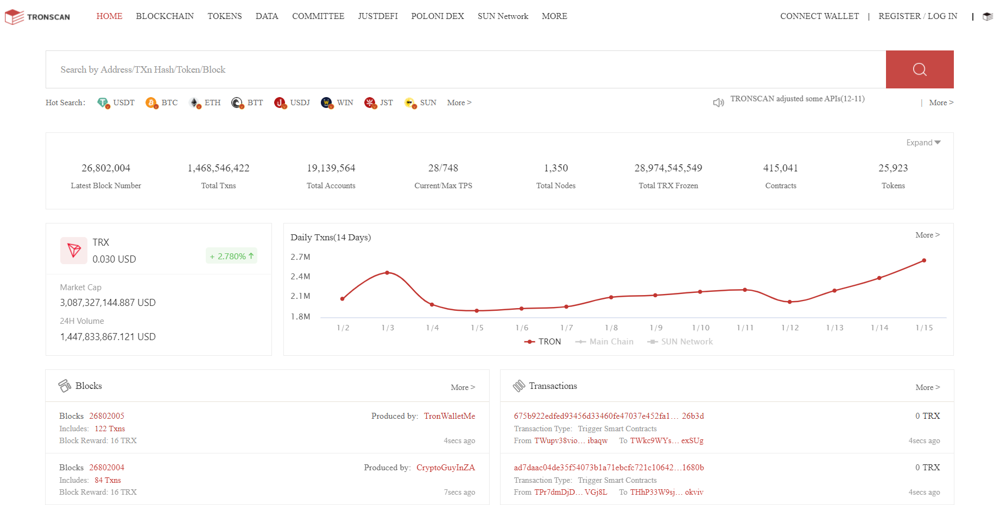

b. Hover Over Blockchain in Top Left Navbar.

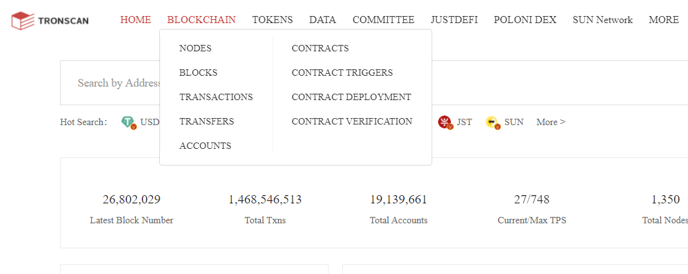

Navigate to Contract Deployment where you'll be able to Deploy your contract <b>Graphically</b>. This method is way a lot easier than deploying the same contract in Ethereum Chain. 😇

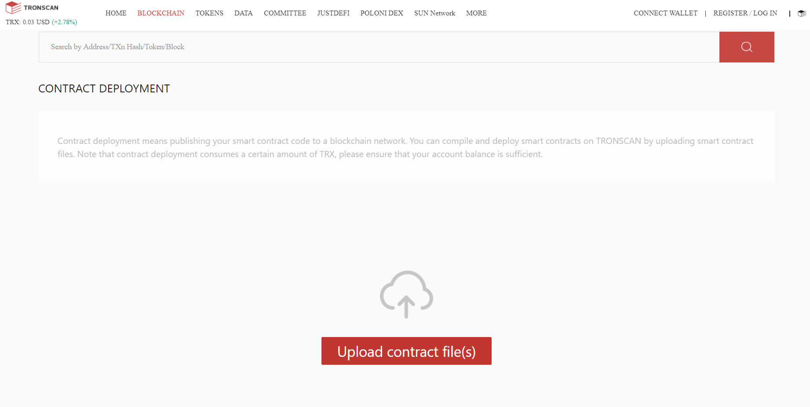

c. Here, if you try to upload the document, it won't work because you need to use the <b>wallet of Tron</b>.

Download the TRONLINK from <a href="https://chrome.google.com/webstore/detail/tronlink%EF%BC%88%E6%B3%A2%E5%AE%9D%E9%92%B1%E5%8C%85%EF%BC%89/ibnejdfjmmkpcnlpebklmnkoeoihofec">here.</a>

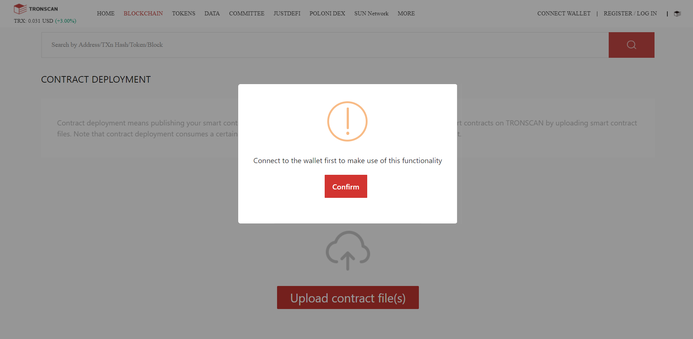

d. Now make sure your wallet is open and ready to ROCK 🤘.

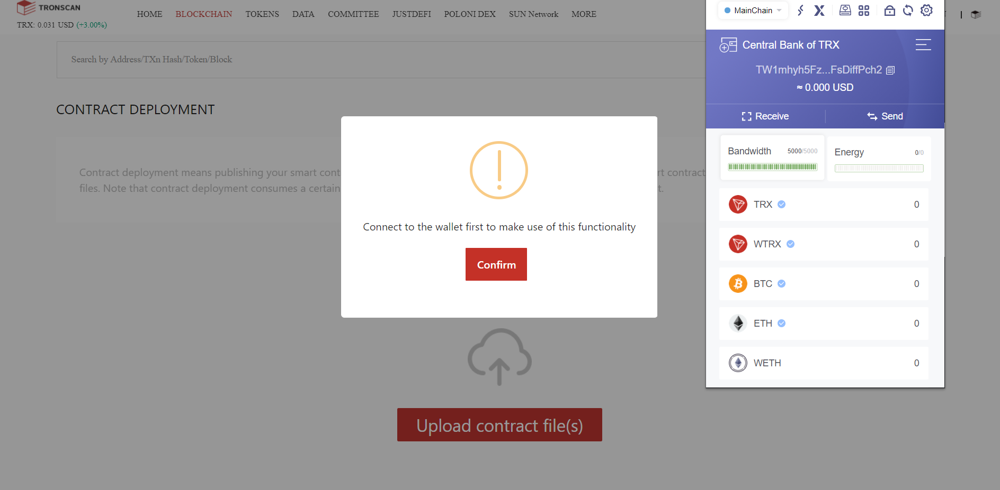

e. Now navigate to Connect Wallet in Top Right of the Navbar

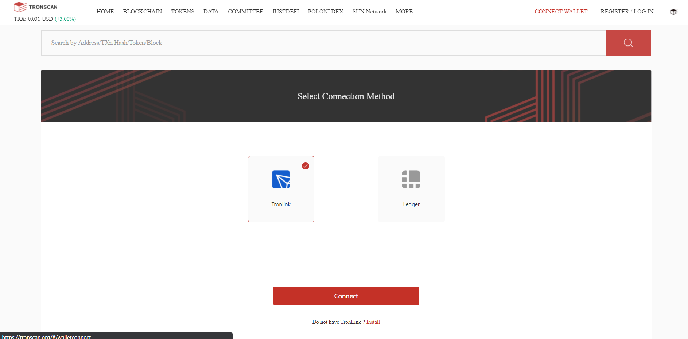

There are 2 options one of them is TRONLINK which you recently installed on your browser extension, other is the hardware wallet named LEDGER but for the convenience you can TRONLINK. 😇

As you saw on my wallet, there is none TRX left to use since I always use them to TRADE LOL. So, Let's use Test Network where you can call for the TRX(TRONIX Coin) from faucet for free development.

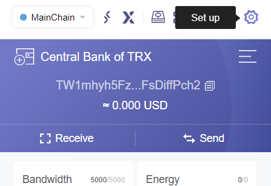

Navigate to Set up and choose Node, where you can see there are lot's of testnet and you can add your own net but I prefer using the shasta testnet since it is more responsive.

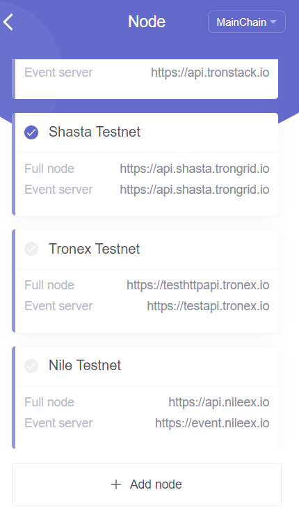

Now, Let's call for the TRX from <a href="https://www.trongrid.io/faucet">Shasta faucet</a>. Copy the public address of wallet and request, after few seconds the fund will be trnasfered to your wallet.

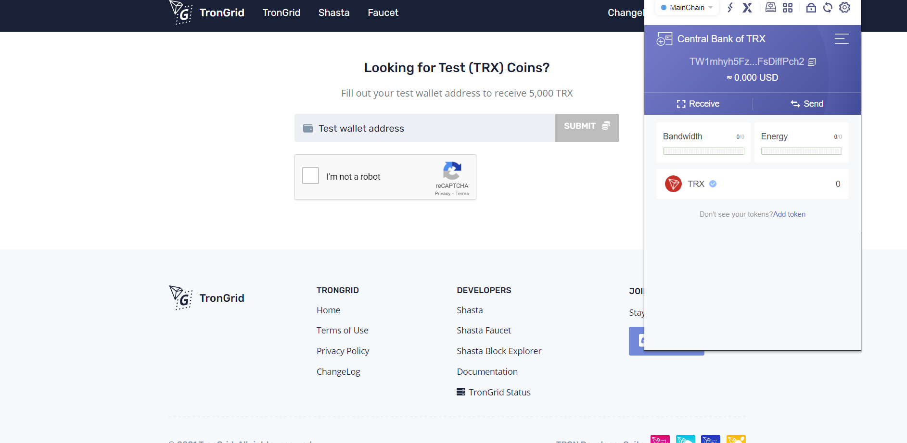

Here, I've got 5000 TRX🔥

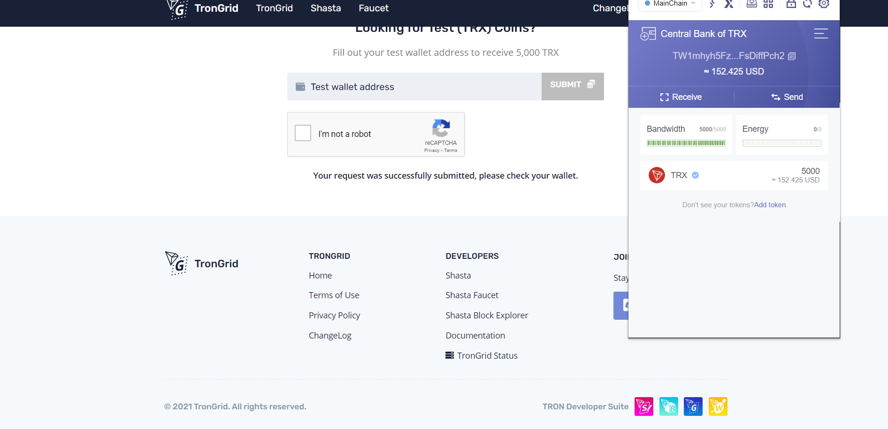

Let's Deploy now. 🚀, Again try to upload all the supportive documents since tronscan allows to upload multiple documents at a time.

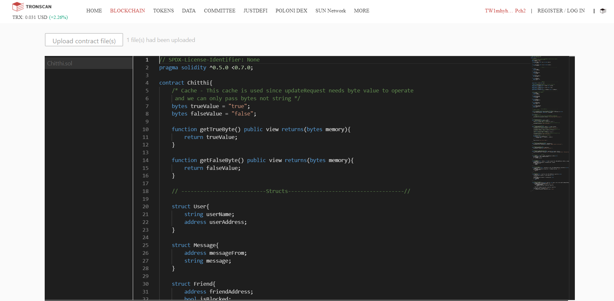

Once the contract, is uploaded naviagate to your main contract in my case it's only one. Now compile your code by choosing the appropriate version of your smart contract.

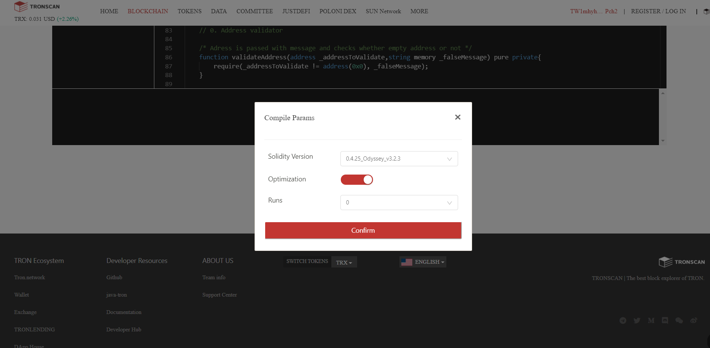

Once you choose the correct version of pragma and compile it, the terminal screen looks like.

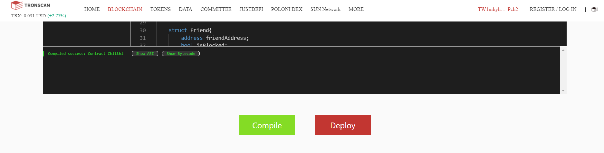

Now, hit deploy for the deployment. Here you should choose the main contract in contract name.

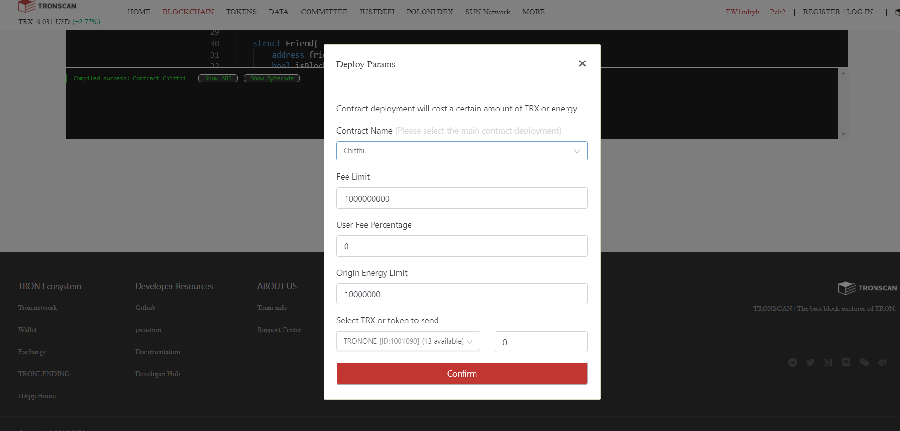

Approve the signature to deploy.

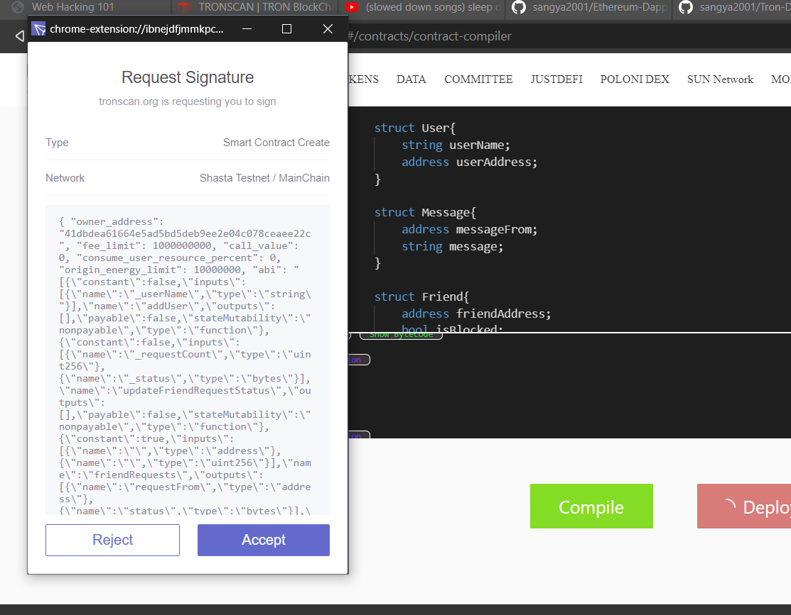